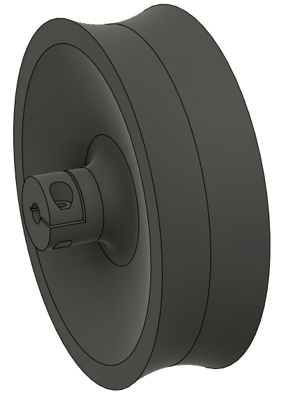

# 3D printing

## Wheel

- `wheel_half.3mf`
- To make the wheels stronger and have an efficient printing time, the wheel is made up of two identical parts, these parts are simply glued together to form a full wheel.
- PETG filament is used for maximum strength.
- For the printing settings, please refer to `readme_data/wheel_printing_settings.curaprofile`.

