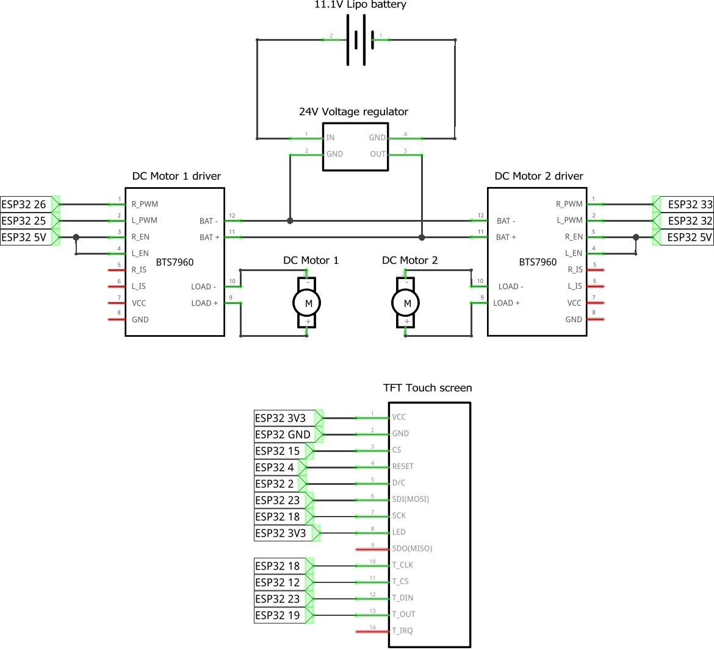
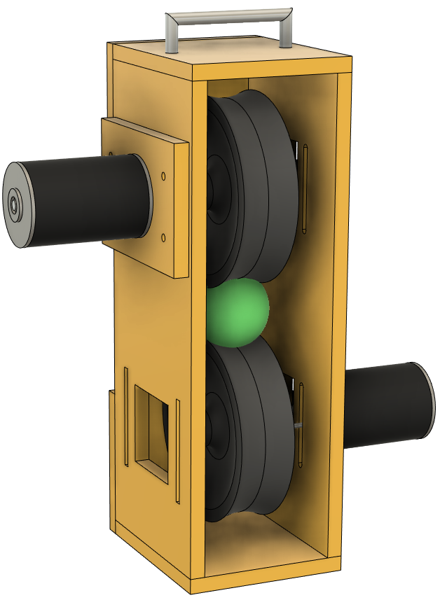
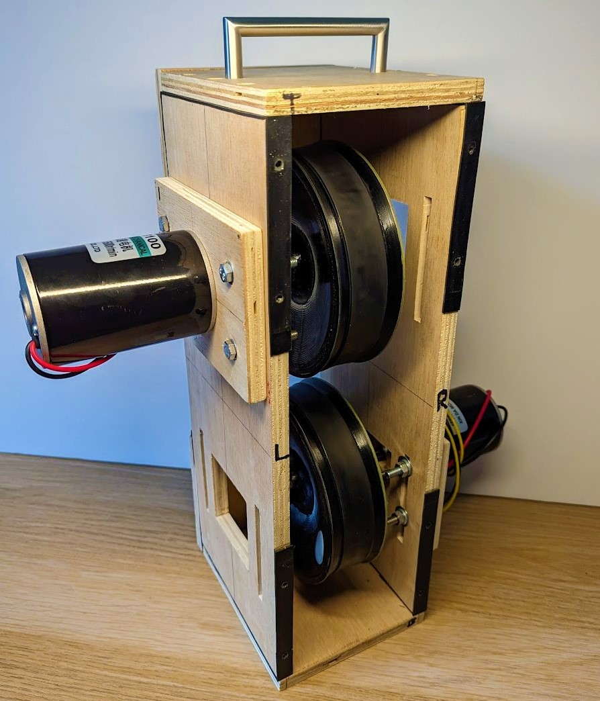

 # Tennis Machine

Current tennis machines only launch balls at random or pre-set fixed positions, which does not provide a realistic or practical training experience. In this project, I am making a tennis ball launcher machine that imitates human playing behaviour, by analysing and tracking court and player data using an on-board camera to recognise the most realistic reply shot that resembles a real tennis player.

The project is in initial development and experimentation stages, more details will be added as the project evolves.

# Current state

The machine can successfully launch balls anywhere on the court with specific speed, top spin, and back spin.

# Components

- [ESP32](https://amzn.eu/d/78Lzigs), for the micro-controller, see `/arduino` for more details.
- [DC Motor 24V 150W 5500RPM](https://amzn.eu/d/2Lb6XL5) (x2), to spin the two wheels to launch balls.
- [BTS7960 DC Motor driver 43A](https://amzn.eu/d/ffBzzgu) (x2), to control the DC motors using the micro-controller.
- [Lipo 3S 11.1V battery](https://amzn.eu/d/eeGYmOE), powers supply.
- [Voltage regulator 12V-24V 10A](https://amzn.eu/d/7cRRwgR), to convert battery 11.1V to 24V for the DC motors.
- [TFT 2.8 LCD touch screen](https://amzn.eu/d/0zSkMGs), to control the machine.
- Plywood 12mm, for the frame.
- 3D printed wheels, to launch the balls, please refer to the `/3d_printing` directory.

# Schematic

# Assembly

| CAD design                                | Assembly                              |
|-------------------------------------------|---------------------------------------|
|  |  |