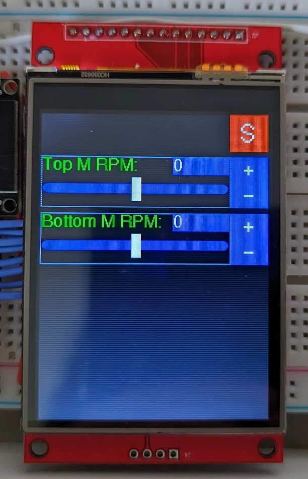

# Libraries required

- `TFT_eSPI` by Bodmer.
- `TFT_eWidget` by Bodmer.

# Structure

- `ESP32.ino`, main Arduino sketch.
- `LauncherMotors.ino`, two dc motors to launch the tennis balls.
- `TFTScreen.ino`, TFT screen to get touch input from the user.
- `Free_Fonts.h`, provided by the `TFT_eSPI` library.

# TFT screen

